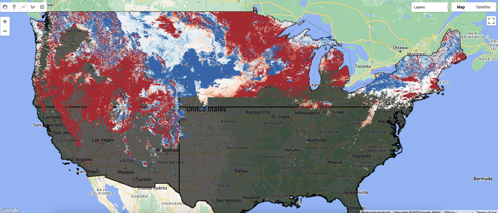
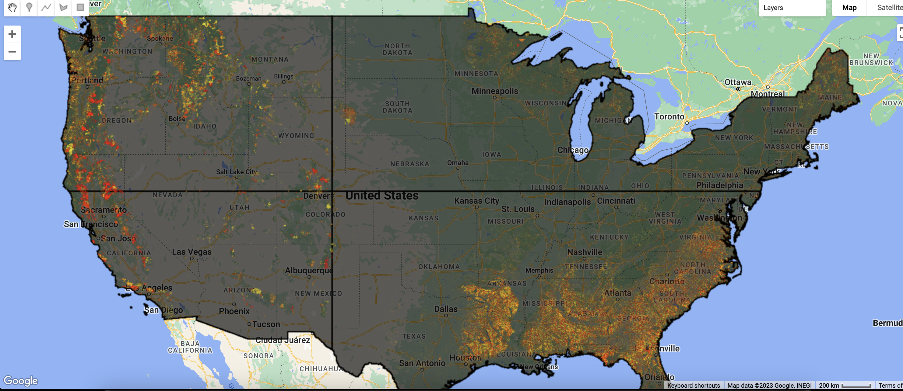

```{r setup, include=FALSE}
knitr::opts_chunk$set(echo = TRUE)
```

# Deforestation and 1st day of no snow cover

A google earth engine project to visualize Deforestation and 1st of no snow cover in the USA. This is in preparation for a Teaching Assistant role I am interested in.

## Why and what did I do?

I wanted to see if deforestation has anything to do with how snowing patterns have changed over the years. The easiest way to check this would be to visualize both of these factors on a map and visually analyze if there is any correlation between both.

## How did I do it?

Google Earth Engine hosts a multi-petabyte collection of satellite imagery along with large-scale analytical abilities. GEE contains a large variety of datasets which are processed to varying degrees.

I used 4 datasets :

1.  [MOD44W.005 Land Water Mask Derived From MODIS and SRTM](https://developers.google.com/earth-engine/datasets/catalog/MODIS_MOD44W_MOD44W_005_2000_02_24)

2.  [MOD10A1.006 Terra Snow Cover Daily Global 500m](https://developers.google.com/earth-engine/datasets/catalog/MODIS_006_MOD10A1)

3.  [Hansen Global Forest Change v1.10 (2000-2022)](https://developers.google.com/earth-engine/datasets/catalog/UMD_hansen_global_forest_change_2022_v1_10)

4.  [LSIB 2017: Large Scale International Boundary Polygons, Simplified](https://developers.google.com/earth-engine/datasets/catalog/USDOS_LSIB_SIMPLE_2017)

The first and second datasets were combined to generate the images for the 1st day of no snow. The third dataset was used to generate the deforestation images. The fourth dataset was used to get the polygon for USA to limit the visualization to just 1 country(for faster processing).

As a beginner in Google Earth Engine, I first wanted to learn the basics of what Google Earth Engine is and what are it's features and capabilities. I watched 1 video recorded by Stace Maples, Assistant Director of Geospatial Collections & Services, Stanford Geospatial Center. I would highly recommend these videos to anyone who wants to know the basics of satellite imagery data and Google Earth Engine. There are some GEE examples as well.

-   [Google Earth Engine 101: An Introduction for Complete Beginners](https://www.youtube.com/watch?v=oAElakLgCdA&t=4453s&ab_channel=StanfordGeospatialCenter)

Google Earth Engine has a list of tutorials to help beginners. They're available [here](https://developers.google.com/earth-engine/tutorials). Again, I highly recommend going through them just to get a sense of what is possible with GEE and it's datasets.

To generate the 1st no snow day, I used the code in one of the tutorials available on the GEE website. For the deforestation layer, the dataset was self explanatory. I extracted one of the bands available and added it as a layer to the map. To limit the scope to USA, i used Google search, Bard, GEE Docs and just general experimentation to figure out how to fit my visualization to USA land only.

## Conclusion

Here are the different Map layers :

1.  1st day of no snow. Color grades from red to blue, with red indicating an earlier date of no snow in 2015 and blue indicating a later date of no snow in 2015. White areas indicate little or no change.



2.  Deforestation.



3.  Both layers superimposed


I have very minimal knowledge about Geology to conclude anything from this :) My initial assumption was that areas with receding 1st day of snow would have larger volume of deforestation. To me, the visualization does not indicate that clearly. There could be a number of latent factors involved. Additionally, the topography of USA is very diverse and my guess is that each topography has it's own factors which affect both deforestation and snowing patterns.

## Reflection and Learnings

Initially, I wanted to create something much more comprehensive with charts, analytics, external data points and map visualizations. But the world of Satellite imagery data and Google Earth Engine is very vast. It has it's own complex datasets, datatypes etc. It took me a long time to understand the basics and finally I settled on this project. I think it's amazing that we have all this data available in public forums which can be used free of cost. The possibilities in this field are endless and I would deifinitely be open to exploring ideas in this space!
